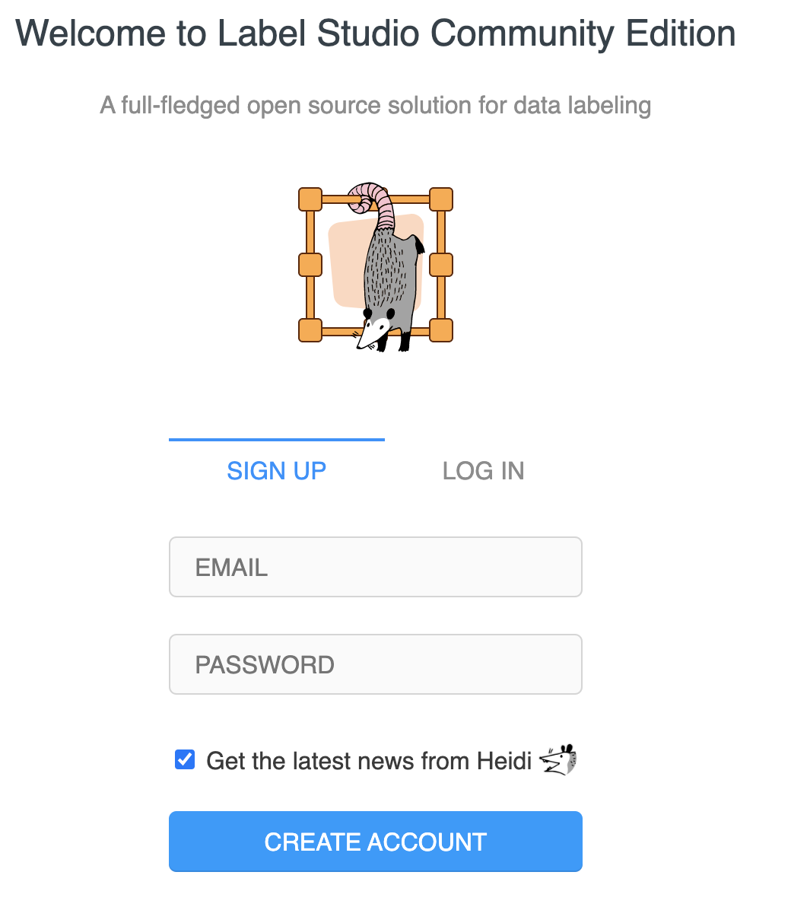
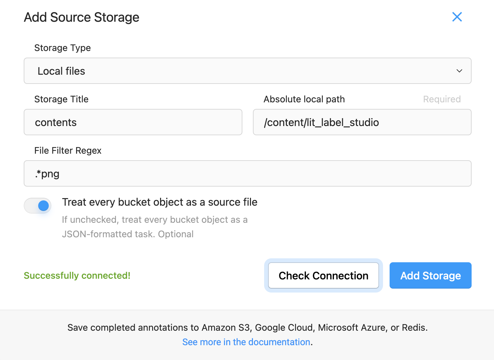

# lit_label_studio component

This ⚡ [Lightning component](lightning.ai) ⚡ was generated automatically with:

```bash
lightning init component lit_label_studio
```

## To run lit_label_studio

First, install lit_label_studio (warning: this app has not been officially approved on the lightning gallery).  This also uses Label Studio fork with x-frame-options support required for iFrame.

- Option git clone
```bash
git clone  https://github.com/robert-s-lee/lit_label_studio
cd lit_label_studio
python -m pip install -e .
```

- Option pip install
```bash
python -m pip install  https://github.com/robert-s-lee/lit_label_studio/archive/refs/tags/0.0.0.tar.gz
```

- Option lightning install
```bash
python -m lightning install component git+https://github.com/robert-s-lee/lit_label_studio.git@0.0.0
```

- verify 
```
python -m pip show lit_label_studio
```

## Setup lit_label_studio virtualenv
  
NOTE: Use `Conda` for Lightning and use `venv` for Label Studio. 
Label Studio and Lightning have library version conflict. 
`venv` is used in the Lightning Cloud.

```bash
virtualenv ~/venv-label-studio 
git clone https://github.com/robert-s-lee/label-studio; pushd label-studio; git checkout x-frame-options; popd
source ~/venv-label-studio/bin/activate; pushd label-studio; which python; python -m pip install -e .; popd; deactivate
```

- test label-studio
```bash
export LABEL_STUDIO_X_FRAME_OPTIONS='sameorgin'
source ~/venv-label-studio/bin/activate; cd label-studio; python label_studio/manage.py migrate; python label_studio/manage.py runserver; cd ..; deactivate
```

## Potential error messages running locally

The `virtualenv` needs to be setup that has label-studio. 
```
FileNotFoundError: [Errno 2] No such file or directory: 'label-studio'
```

## Potential error messages based on X-Frame-Options settings

On the Browser, right click -> Inspect, then look at console for these messages

- sameorigin

Click on the URL to display the iFrame

```bash
lightning run app app.py --cloud --env LABEL_STUDIO_X_FRAME_OPTIONS=SAMEORIGIN'

Refused to display 'https://xlzzf-01gbz0k4ztj38ysezs6zwja8jm.litng-ai-03.litng.ai/' in a frame because it set 'X-Frame-Options' to 'sameorigin'.
```

### Does not work in the Lighting Cloud

- allow-from *
  
```
lightning run app app.py --cloud --env LABEL_STUDIO_X_FRAME_OPTIONS='allow-from *'

Invalid 'X-Frame-Options' header encountered when loading 'https://xlzzf-01gbz0k4ztj38ysezs6zwja8jm.litng-ai-03.litng.ai/': 'ALLOW-FROM *' is not a recognized directive. The header will be ignored.
```

- allowall
 
```
lightning run app app.py --cloud --env LABEL_STUDIO_X_FRAME_OPTIONS='allowall'

'allowall' does not display the login
```

- allow-from 
```
lightning run app app.py --cloud --env LABEL_STUDIO_X_FRAME_OPTIONS='allow-from https://xlzzf-01gbz0k4ztj38ysezs6zwja8jm.litng-ai-03.litng.ai'

Invalid 'X-Frame-Options' header encountered when loading 'https://gytcu-01gbz7p6j2rb2q8p7sdgcvwrxt.litng-ai-03.litng.ai/': 'ALLOW-FROM HTTPS://XLZZF-01GBZ0K4ZTJ38YSEZS6ZWJA8JM.LITNG-AI-03.LITNG.AI' is not a recognized directive. The header will be ignored.
```

Once the app is installed, use it in an app:

```python
from lit_label_studio import LitLabelStudio

import lightning_app as la

class LitApp(la.LightningFlow):
    def __init__(self) -> None:
        super().__init__()
        self.lit_label_studio = LitLabelStudio()

    def run(self):
        self.lit_label_studio.run()

app = la.LightningApp(LitApp())
```

## Run Locally and on the Cloud
```
export LABEL_STUDIO_X_FRAME_OPTIONS='sameorgin'
lightning run app app.py

lightning run app app.py --cloud --env LABEL_STUDIO_X_FRAME_OPTIONS='SAMEORGIN'
```
## Sign Up 


## Lightning Drive usage inside Label Studio

On the cloud, Absolute local path for this app name is `/content/lit_label_studio`.  Replace `lit_label_studio` with your app name.

This behavior on controlled by the component.
```
'LABEL_STUDIO_LOCAL_FILES_SERVING_ENABLED':'true', 
'LABEL_STUDIO_LOCAL_FILES_DOCUMENT_ROOT':os.path.abspath(os.getcwd())
```

